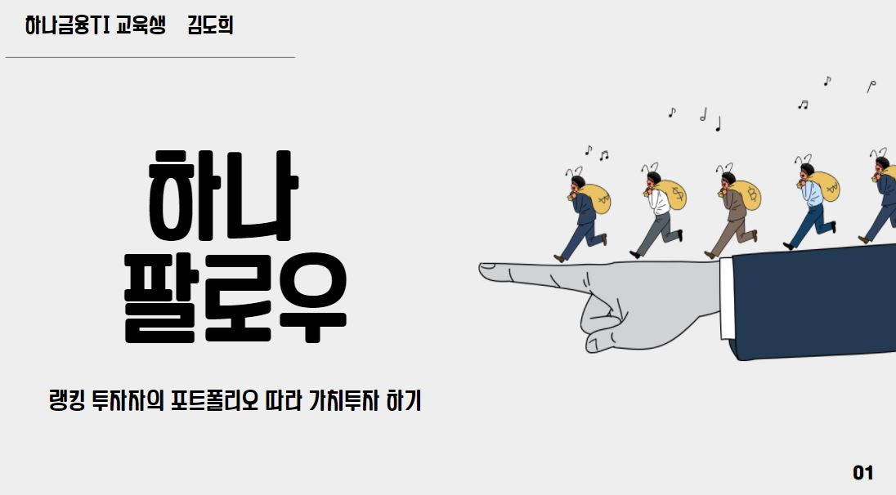
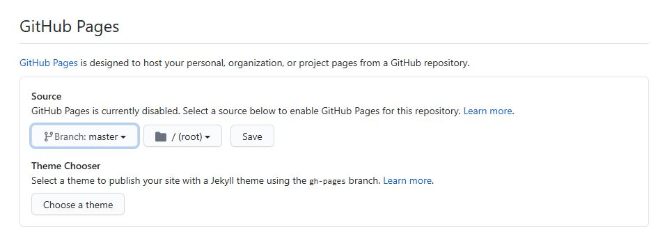

# 프로젝트 제목

[프로젝트 홈페이지 - https://koposoftware.github.io/template/](https://koposoftware.github.io/template/)

# 1. 프로젝트 개요

<strong>배경</strong>
- 개인 투자자로서 금융인플루언서들은 실제로 어떤 종목을 보유하며, 어떤 업종을 주로 매매하는지에 대하여 궁금증을 갖게 되었습니다. 

<strong>서비스</strong>
- 투자자에게 금융 정보를 제공하며 매매가 가능한 통합된 증권 서비스입니다. 

<strong>장점</strong>
- 투자자가 보유한 종목, 업종 구성비 등을 살펴 볼 수 있습니다. 이후 포트폴리오의 업종 구성비율인 분산투자 정보를 저장한 후 종목과 매수수량을 추천받을 수 있습니다.

  
- 서비스는 참여자 모두가 이익을 취합니다. 중개인인 하나금융투자는 하트 충전으로 인한 예수금 증가로 현금흐름이 개선됩니다.

  

# 2. 프로젝트 제안서

   <strong>시스템 아키텍처</strong>

   
   
   [발표자료](/project.pptx) 
   

# 3. 프로젝트 결과

## 발표 ppt 
   [발표자료](/project.pptx) 

## 시연 동영상 
<iframe width="640" height="360" src="https://www.youtube.com/embed/fY5uGsL_LnI" title="YouTube video player" frameborder="0" allow="accelerometer; autoplay; clipboard-write; encrypted-media; gyroscope; picture-in-picture" allowfullscreen></iframe>
  

# 4. 본인 소개

|이름 |김도희||
|연락처 | gmlwjd6066(@)naver.com|
|skill set| Frontend - HTML, CSS, Javascript|
| | Backend - Java, Spring, Oracle|
|자격증|  SQLD, 정보처리기사, 신용분석사, AFPK|
|수상| 폴리텍 창업경진대회 입상|

# 5. 기타
그외 프로젝트를 더욱 설명할수 있는 것들을 추가하세요

# 홈페이지 설정
 본인 repository에서 "Setting"를 들어가서 GitHub Pages에서 설정 변경.
* Source
 Source에서 원하는 branch와 directory 설정한다. 
 기본값은 master 에 root를 설정 
 Save 버튼 꼭 누른다.
 
 * Theme Chooser
 theme을 변경하여 좀더 이쁜 홈페이지를 만든다.
   
    
   
 
